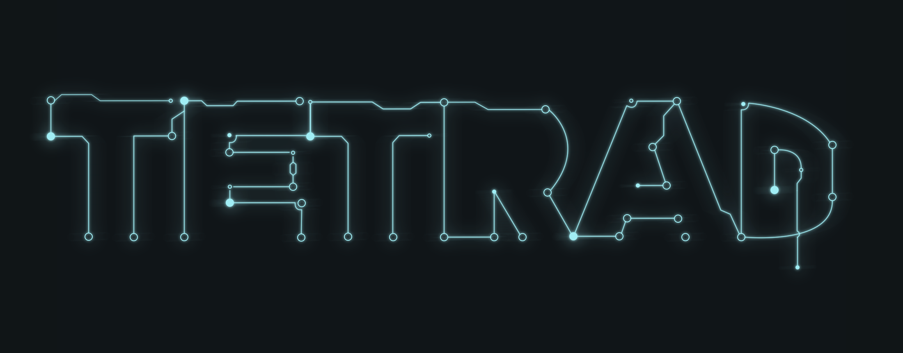

## Summary
Tetrad is a flexible and easily extensible engine that allows
designers and developers alike to make significant changes to gameplay
and game structure at runtime.

> Note: This project is no longer actively developed. If I were to
> make a game engine today, it would be written in Rust and built
> around the [amlang](https://github.com/akhouderchah/amlang)
> project.

## Getting Started
See the [build
instructions](https://github.com/akhouderchah/tetrad-engine/blob/master/docs/Building.md)
to get a working binary up and running.

## Contributing
Contributions to the core engine code are always welcome. See the
[developer docs](./docs/Developer.md)
for information to get you started.

